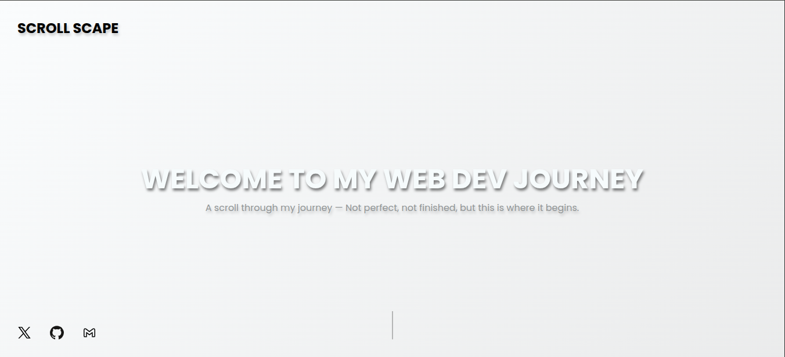
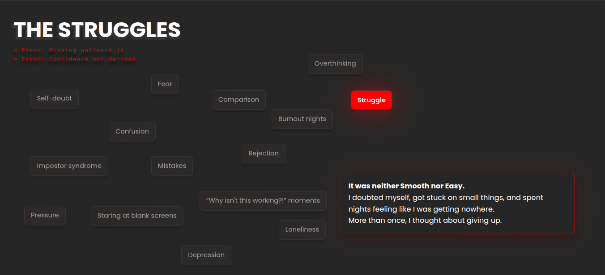

🌌 My Journey – A Story Told in Code

A storytelling web project that visualizes my journey into coding — from struggles to small wins to building a vision for the future.

This isn’t just a static site — it’s designed like a narrative, with sections that reflect different stages of growth, styled with gradients, animated cards, and smooth transitions.

📸 Preview

🚀 Live Demo

([👉 View Live Project](https://scroll-scape.netlify.app/)

🎨 Features

✨ Multi-section storytelling design: The Beginning, The Struggles, The Rise, The Vision.

🌈 Custom gradients and glowing effects for each section.

🎭 Animated narrative cards that reinforce the story.

📱 Responsive layout for different screen sizes.

⚡ Built with HTML, CSS, Vanilla JavaScript and GSAP — no frameworks.

🛠 Tech Stack

HTML5

CSS3 (gradients, animations, backdrop blur)

JavaScript (interactions)

GSAP (Scroll animations)

📂 Project Structure
SCROLL-SCAPE/
├── assets/
│ └── animations/
│ └── scrollDownAnimation.json
│
├── js/
│ ├── lottie.js
│ └── script.js
│
├── static/
│ ├── fonts/
│ └── images/
│
├── animation.css
├── responsive.css
├── style.css
│
├── index.html
├── LICENSE
└── README.md

💡 Why This Project?

This project represents my coding journey.
It’s more than a simple app — it’s a creative experiment that combines design, storytelling, and frontend skills in one place.

I wanted to build something that not only tests my technical skills but also reflects who I am as a developer.

⚡ How to Run Locally

Clone the repo

git clone https://github.com/aqeel-sheikh/Scroll-Scape.git

Open index.html in your browser.

📬 Contact

If you’d like to connect or collaborate:
📧 sheikhakeelw01@gmail.com

 | X(🐦) @aqeell.sheikh